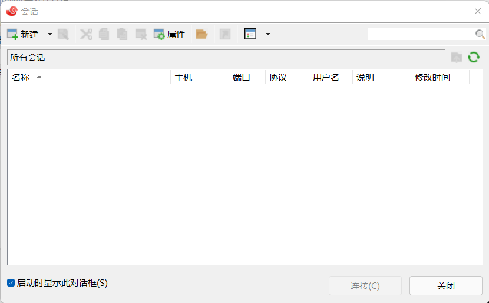
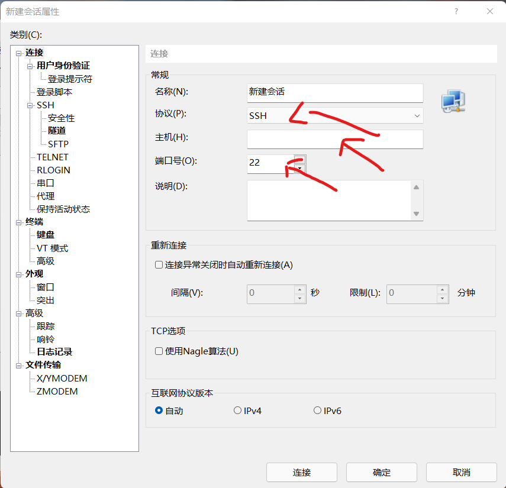
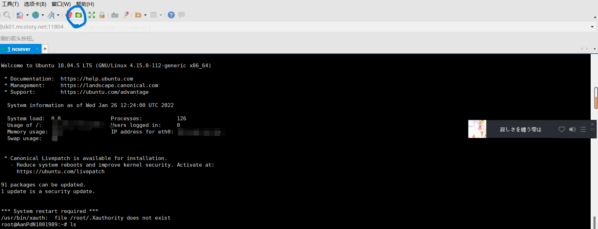
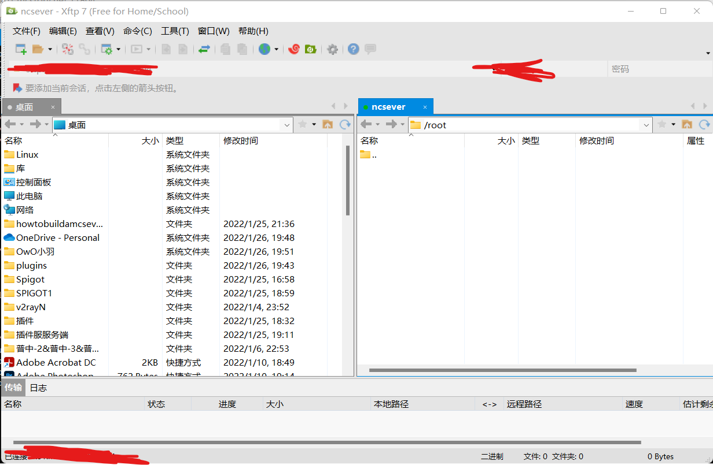

# ~~打倒资本家的liunx开服法~~
## 前言
- 本教程编者十分推荐各位去阅读另一篇  [零基础开服指南](https://www.mcbbs.net/thread-980386-1-1.html)
- 作者认为本篇教程只是与上方的教程进行一定的补充，帮助那些服务器资源不太足够，但是想要开服的玩家，才写了这样的一篇教程，如果有不懂的地方建议看一下上方的教程在来回看这篇教程说不定有许多东西可以重新理解。
- 本教程只用于，想用liunx开服，不怕折腾的玩家。
- 本人推荐小白使用Windows 而不是liunx作为第一次的开服平台
- 因为编者水平有限，部分内容可能有所欠缺。
- 教程内容有些部分进行了一定的简写,或者略写。
## 1. 为什么要用liunx开服
- 啊啊因为liunx稳定性和高效性......低配置......这里省略超多的字(因为写了也没人看的所以说索性不写了喵wwww)
- > 其实最重要的还是因为liunx省内存啊,在面对阿里云腾讯云等等idc学生能白嫖到的服务器基本上内存很小 U很弱什么的，这个时候如果在跑上一个window sever 带一个图形化界面2G的内存也要被window 娘恰掉 3/4或者 1/2左右，简直让人难受的一匹，这个时候liunx他来了来了！！！！！！！！！！！！
- > 你说什么？liunx如果你是1G的内存还可以开一个mc服务器？对你没有听错1G内存开mc服务器在内存占用率轻轻松松恰掉1G或者2G的现代还有这么良心的系统吗？
- > 那么我们老是说的liunx 为什么在百度上找到了介绍但是没有找到一个叫liunx的系统呢？因为现在liunx有很多的发行版，我们只需要选一个发行版进行安装和使用就好了。
- > 现在的发行版 有centOS和Ubuntu等。在这个教程咱主要选择Ubuntu进行命令的讲解和操作。
- >> **注意在各种发行版之间有很多操作基本相同部分操作不相同的地方可以通过百度进行了解本文尽可能不多赘述**
## 2. 开始
- ### 了解你需要的服务器配置
  **我说你都看到这个教程了真的需要这一章的内容吗。。。。**
  1. 搭建我的世界的服务器首先要确定是你想要开一个mod(模组)服务还是纯净服务器,确定这个需求尤为重要,对于模组服来说应该选择一些内存稍微大一些服务器最好的是可以选择4G或者4G以上内存的服务器,**当然请不要只认为服务器性能的释放与内存是否足够大有关这一点请牢记**关于服务器的整体性能有关很多方面
  2. 内存: 如果你什么都不知道可以简单的理解为盘子或者桌子的大小,一般来说内存越大越好，但是在开服的情况下来说真的不是很需要直接上非常大的内存因为即便购买了很大的内存，请按照你的需求进行一定的选择。
  3. 处理器 请不要一看到某些服务商的处理器主频高就说 **好耶！这个VPS(叫服务器也是可以的吧)主频高还便宜我要买这个！！！！！！！**在当下的处理器核心频率在一定范围内决定处理器的性能高低但是已经并不是决定性作用了,在这里简单的说一下尽可能挑选较新的处理器型号，同时代可以进行频率的比对。
  4. 网络尽可能选择宽带较大的服务器。 
  5. 多余的不在赘述,在[给小白看的开服教程中](https://www.mcbbs.net/thread-980386-1-1.html)在开始那一章已经有足够的介绍。
>>我会说我就是懒啊所以说才就写这些的吗
- ### 连接接到你的liunx服务器上www
- #### 1. 准备
  - 需要下载的软件
    - putty 或者 Xshell等可以进行ssh远程连接的软件
    - SFTP  或者Xftp
  - 本篇作者在编写教程时认为读者已经准备好
    - 已经购买到一台装有 ubuntu的VPS 
    - 已经下载并安装好了上述软件
>在这里因为个人习惯的问题选择Xshell和Xftp进行演示，其他软件因为基本操作方式大同小异所以建议百度喵！或者我不懒了在扩充一下。。。

在开始的时候你可能会收到一个类似这样的信息
```
ExampleCloud Ex云计算  后台信息  
套餐：Ex 开通日期：1970.01.01
========================
【ssh连接地址】
BGP多线：ex.example.com:61389
=========================
【系统信息】
系统：Ubuntu 18.04.5 LTS
用户名：root
密码：Example!.
为了保障您后台的数据安全，减少被别有用心之人利用的可能性，我们建议您更高更高强度的系统密码，以免造成不必要的损失。
=========================
【游戏连接地址】
BGP多线：ex.example.com:端口
开放端口：61390-61398 九个端口内外对应
=========================
请牢记您的VPS的编号：EX-01
若遇到无法解决的问题或是技术服务的话
请提供VPS编号，这样我们方便识别您的VPS信息
========================
感谢您选择我们，您的支持使我们继续发展下去的动力
```
我们可以从这个信息里面了解到你的用户名和登录密码,登录端口等信息
>在这里补充一下如果通过腾讯云vps或者阿里云那种独享ip的机器一般ssh连接端口为22
- #### 2.Xshell+Xftp
好的那么我们已经知道了连接的地址和密码让我们打开Xshell

如果正常的话你会看到这个图片点击新建按钮

让我们把了解到的信息填入到主机(主机是你了解到的vps地址)端口号则是你了解到的端口信息,点击连接

在弹出的ssh安全警告下点击**接受并保存**

输入用户名,密码。进入到服务器
如果一切正常的话就可以看到如下的提升信息和界面了

之后点击被圈出的按钮,如果你已经安装好了Xftp的话
应该会看到如下界面

这个就是上传服务端需要用到的软件

**至此本节内容已经结束**
- #### 3.putty+SFTP
>>欸嘿嘿嘿这个之后在写啦www
- ### 配置java环境

- ### 在本地处理好你的liunx服务端
- ### 上传
- ### 了解开服的指令和screen
- ### 在让人蛋疼的命令行里面快速的修改插件的配置
- ### 了解crontab 进行每日的服务器备份
- ### 一个简单且常用的开服脚本
- ### 安装mysql 或者搞个docker？
- ### 如果你恰巧有域名的话。。。。
- ### 遇到困难不要怕，面向百度求助
## 3.编者的碎碎念www


[//] 给我自己看的 记得说一下文件的基础操作
[//] 可以教一下关于severcat 之类的提示用工具